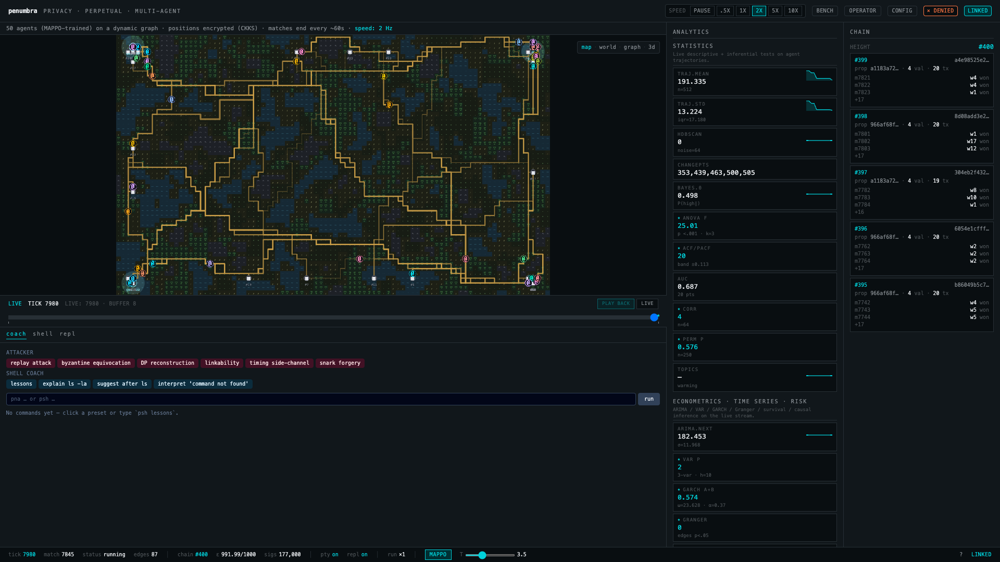

# Penumbra



> A privacy-preserving multi-agent arena built to teach statistics,
> linear algebra, modern neural networks, and cutting-edge cryptography
> in one integrated runtime — with an adversarial attacker console and
> a real macOS/Unix shell coach baked in.

**Status**: **v1.0 — feature-frozen.** Future work moves to focused
spin-off projects that reuse packages from this monorepo (see
[`CHANGELOG.md`](CHANGELOG.md) v1.0). Maintenance + security fixes
welcome; new features land in the spin-offs.

## Try it in 30 seconds

```sh
git clone https://github.com/Vadale/penumbra-arena
cd penumbra-arena
make demo
```

`make demo` installs deps (uv + pnpm), boots the FastAPI backend on
:8100, the Vite dev server on :5173, waits for `/health` to answer,
and opens your browser. Quit later with `pkill -f penumbra_transport
.api ; pkill -f vite`. See [`USAGE.md`](USAGE.md) for the hands-on
tour.

## Want to see ONE primitive without booting the stack?

`examples/` holds 6 self-contained scripts, ~100 LOC each, no backend
required:

```sh
uv run python examples/01_dp_budget_walkthrough.py
uv run python examples/02_ckks_encrypt_aggregate.py
uv run python examples/04_merkle_cve_2012_2459.py
```

See [`examples/README.md`](examples/README.md) for the full list.

## What's inside

50 autonomous agents compete on a procedurally dynamic graph. Each
agent's true state is encrypted (CKKS); the spectator sees only
DP-noised aggregates. Every pillar fires on every tick:

- **Neural networks** — MAPPO multi-agent RL on Apple MPS, GATv2
  pathfinder, live PPO training that mutates the running policy
- **Cryptography** — CKKS + TFHE homomorphic encryption, differential
  privacy with budget accounting, post-quantum (Kyber + Dilithium +
  SPHINCS+), BLS aggregate signatures, VRF leader election, Wesolowski
  VDF, Groth16 + STARK verifiers, FROST, BBS+, Verkle, threshold ECDSA
- **Statistics** — descriptive + inferential + econometrics (OLS / IV /
  GMM / VAR / GARCH / Granger / ARIMA) + Monte Carlo (Sobol QMC) +
  causal (IPW / AIPW) + survival (Kaplan-Meier) + Bayesian (NumPyro SVI)
- **Linear algebra & topology** — graph Laplacians + spectral
  clustering + persistent homology + optimal transport
- **Blockchain** — local PoS-VRF chain with BLS-aggregated finality,
  Merkle (CVE-2012-2459-resistant), mempool, slashing
- **Adversarial** — 12 attack demos (`pna` CLI + dashboard chips)
- **Shell** — 19 lessons (`psh` CLI + sidebar)

Every concept has a clickable dashboard tile that opens an educational
modal. The full concept → file index is in
[`CONCEPTS.md`](CONCEPTS.md).

## Want to fork a focused piece?

Penumbra is intentionally a monorepo of well-built primitives — easier
to mine than to extend. The most-extractable parts:

- **`packages/chain/`** (~95 % reusable) → the seed of
  `penumbra-chain-sim`, a standalone educational PoS-VRF simulator
- **`packages/crypto/penumbra_crypto/educational/`** (Shamir + Beaver
  + Pedersen + Schnorr + TFHE + Yao) → standalone pip package
  `penumbra-educational-crypto` for SMPC pedagogy
- **`packages/analytics/`** + `apps/web/src/charts/` → the seed of a
  stats workspace where users upload their own CSV

If you build something on top of (or out of) Penumbra, open an issue —
happy to link from the README.

## Project map

```
packages/
  core/         arena + agent + simulation + market economy + logistics
  crypto/       CKKS, DP, Kyber, Dilithium, BLS, VRF, VDF, Groth16, STARK,
                FROST, SPHINCS+, BBS+, Verkle, threshold ECDSA, Yao, PSI,
                mix-net + educational SMPC primitives + defenses
  chain/        block + Merkle + PoS-VRF + BLS aggregate + slashing
  learning/     MAPPO + GATv2 + LiveTrainer + federated (DP-SGD, Krum,
                FedProx, CKKS aggregation) + Rényi DP accountant
  analytics/    13 streaming consumers + dashboard pipeline
  attacker/     12 attacks + pna CLI
  shell_coach/  19 YAML lessons + suggester + explain + psh CLI
  transport/    FastAPI + WS + PTY + REPL + orchestrator + EventBus
  operator/     20-action cyber-range mode + 12 scenarios + pno CLI
  ctf/          5 capture-the-flag challenges
  notebook/     %penumbra Jupyter magics
apps/web/       React 19 + Vite + r3f + tailwind v4
infra/          docker compose + Dockerfiles
circuits/       circom + snarkjs (multiplier + legal_path Groth16)
examples/       6 standalone scripts — one primitive each, no full stack
scripts/        demo.sh + memory profile + stress test + post-stress analysis
```

## Docs

| File | Purpose |
|---|---|
| [`README.md`](README.md) | this file — orient + try |
| [`USAGE.md`](USAGE.md) | hands-on tour, CLI walkthroughs, REST endpoints |
| [`CONCEPTS.md`](CONCEPTS.md) | every named concept → file:line |
| [`BUILDING_GUIDE.md`](BUILDING_GUIDE.md) | 10-phase pedagogical re-build |
| [`CHANGELOG.md`](CHANGELOG.md) | what shipped when, including v1.0 freeze |
| [`ROADMAP.md`](ROADMAP.md) | build phases and shipped scope |
| [`CLAUDE.md`](CLAUDE.md) | conventions, architecture, memory budget |
| [`SECURITY.md`](SECURITY.md) | disclosure process |
| [`SECURITY_AUDIT.md`](SECURITY_AUDIT.md) | crypto/chain/attacker audit findings |
| [`CONTRIBUTING.md`](CONTRIBUTING.md) | setup, conventions, PR process |
| `packages/<name>/README.md` | per-package "concept taught" + endpoints |

## Develop

```sh
make dev      # boot backend + frontend (no auto-browser)
make test     # backend pytest (-k "not slow") + frontend vitest
make lint     # ruff + pyright + biome
make clean    # remove .venv, node_modules, dist
```

## Hardware target

Mac mini M4, 16 GB RAM. Tested green; under 8 GB total with browser
+ all subsystems active. Tuning levers documented in
[`CLAUDE.md`](CLAUDE.md).

## License

- Code: **MIT** — see [`LICENSE`](LICENSE)
- Data: **CC-BY-4.0** — applies to `state/datasets/**`. See
  [`LICENSE-DATA`](LICENSE-DATA)

Sole author: **Vadale**.

## Citation

```bibtex
@software{vadale2026penumbra,
  author = {Vadale},
  title  = {Penumbra: a privacy-preserving multi-agent arena},
  year   = {2026},
  url    = {https://github.com/Vadale/penumbra-arena},
  note   = {v1.0, MIT-licensed code + CC-BY-4.0 dataset}
}
```
